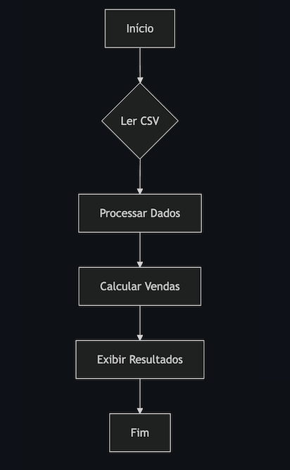
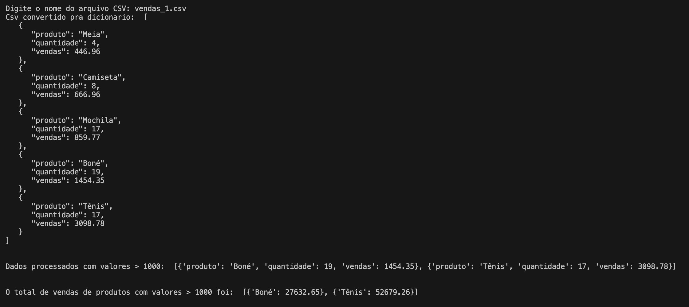

#### Pipeline ETL utilizando Funções

Desafio: Análise de Vendas de Produtos 

Objetivo: Dado um arquivo CSV contendo dados de vendas de produtos, o desafio consiste em ler os dados, 
processá-los em um dicionário para análise e, por fim, calcular e reportar as vendas totais por categoria de produto.

 <h4>Fluxograma<h4> 

 

 **Tarefas**:

1. Ler o arquivo CSV e carregar os dados.
2. Processar os dados em um dicionário, onde a chave é a categoria, e o valor é uma lista de dicionários, cada um contendo informações do produto (`Produto`, `Quantidade`, `Venda`).
3. Calcular o total de vendas (`Quantidade` * `Venda`) por categoria.

#### Funções

1. **Ler CSV**:
    
    * Função: `ler_csv`
    * Entrada: Nome do arquivo CSV
    * Saída: Lista de dicionários com dados lidos
2. **Processar Dados**:
    
    * Função: `processar_dados`
    * Entrada: Lista de dicionários
    * Saída: Dicionário processado conforme descrito
3. **Calcular Vendas por Categoria**:
    
    * Função: `calcular_vendas_categoria`
    * Entrada: Dicionário processado
    * Saída: Dicionário com total de vendas por categoria

<h4>Exemplo de saída do programa utilizando o arquivo vendas_1.csv<h4>

 

